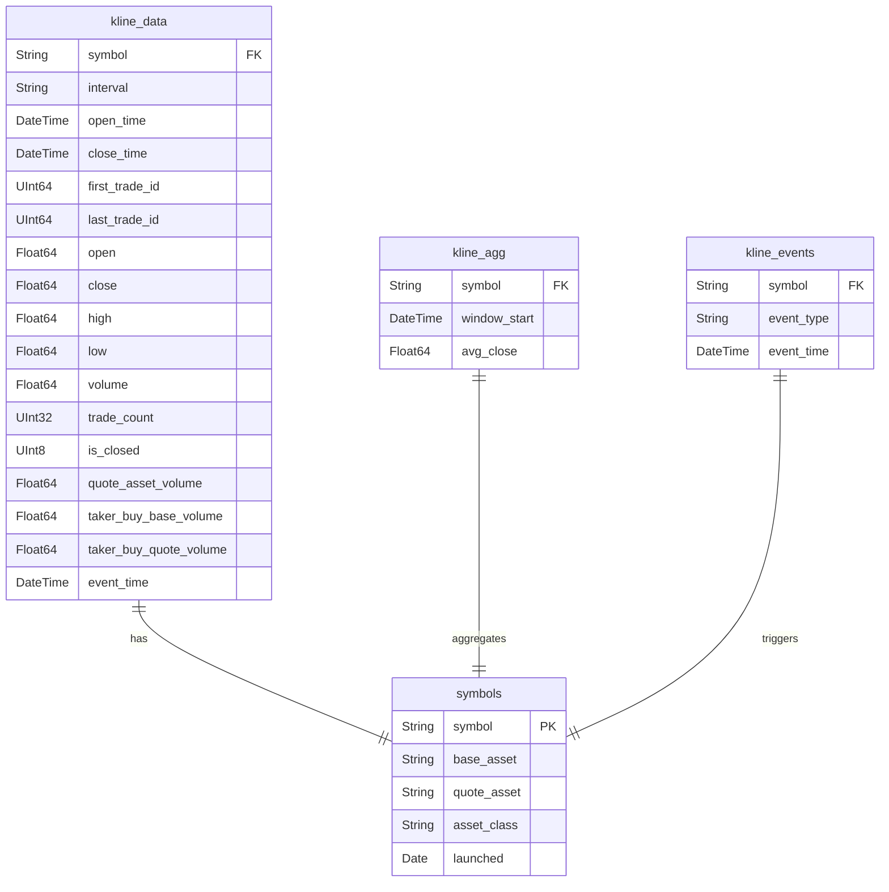

# OLAP Pipeline for Bitcoin Kline Data

This project outlines a test pipeline to read live trade data from Binance WebSocket into a Kafka MQ, and process this stream of data using Apache Flink, storing 1 minute windowed aggregated data into ClickHouse, a columnar database.


Flink Windowed Aggregation


## References

1. Binance Spot API Documentation: [Link](https://github.com/binance/binance-spot-api-docs/blob/master/web-socket-streams.md)

## Setup

Java 11 support

```sh
export JAVA_HOME=/c/'Program Files'/java/jdk-11.0.13/ && export PATH=$JAVA_HOME/bin:$PATH

java -version  # should now show Java 11
```

Start docker services for Zookeeper and Kafka

```sh
chmod +x ./start.sh

bash start.sh
```

[If you did not use docker compose] Start the Binance WebSocket client that will ingest the data into a Kafka broker.

```sh
cd data-ingest
go run .
cd ..
```

Expected logs:

```sh
2025/07/13 17:01:28 websocketClient.go:26: Connecting to Binance WebSocket at wss://stream.binance.com:9443/ws/bnbbtc@trade
2025/07/13 17:01:28 websocketClient.go:54: [SubscribeToStream] Successfully subscribed to streams: [bnbbtc@kline_1m]
2025/07/13 17:01:28 kafkaWriter.go:19: [WriteMessageFromStream] Starting to write messages to Kafka topic: binance.kline at key: bnbbtc
2025/07/13 17:01:29 websocketClient.go:71: [ReadMessages] Received message, passed to channel: {"result":null,"id":1}
2025/07/13 17:01:30 kafkaWriter.go:29: [WriteMessageFromStream] Successfully wrote message to Kafka: {"result":null,"id":1}
2025/07/13 17:01:30 websocketClient.go:71: [ReadMessages] Received message, passed to channel: {"e":"kline","E":1752397290016,"s":"BNBBTC","k":{"t":1752397260000,"T":1752397319999,"s":"BNBBTC","i":"1m","f":273280640,"L":273280663,"o":"0.00585100","c":"0.00585000","h":"0.00585100","l":"0.00584900","v":"5.68800000","n":24,"x":false,"q":"0.03327391","V":"1.25900000","Q":"0.00736515","B":"0"}}
2025/07/13 17:01:31 kafkaWriter.go:29: [WriteMessageFromStream] Successfully wrote message to Kafka: {"e":"kline","E":1752397290016,"s":"BNBBTC","k":{"t":1752397260000,"T":1752397319999,"s":"BNBBTC","i":"1m","f":273280640,"L":273280663,"o":"0.00585100","c":"0.00585000","h":"0.00585100","l":"0.00584900","v":"5.68800000","n":24,"x":false,"q":"0.03327391","V":"1.25900000","Q":"0.00736515","B":"0"}}
```

Start the Flink client using Maven - itwill act as the consumer in the Kafka topic.

```sh
cd flink-binance-consumer/

mvn clean compile exec:java
```

Expected logs:

```sh
10> {"result":null,"id":1}
11> {"e":"kline","E":1752397290016,"s":"BNBBTC","k":{"t":1752397260000,"T":1752397319999,"s":"BNBBTC","i":"1m","f":273280640,"L":273280663,"o":"0.00585100","c":"0.00585000","h":"0.00585100","l":"0.00584900","v":"5.68800000","n":24,"x":false,"q":"0.03327391","V":"1.25900000","Q":"0.00736515","B":"0"}}
```

- 10> means subtask 10 of the parallel operator instance printed that log.
  - Flink assigns subtasks (small independent workers) to run parts of the operator logic in parallel.
  - If the operator has a parallelism of 12, you’ll see log lines from subtasks 0>, 1>, ..., 11>.

If you used Docker, you can query from Clickhouse container

```sh
docker exec -it clickhouse clickhouse-client --password default
```

```sql
use trades

select * from kline_agg
```

Result

```sh
Query id: c6241df8-91aa-4ddb-8e88-10c35c6add6a
   ┌─symbol─┬────────window_start─┬────────────avg_close─┐
1. │ BNBBTC │ 2025-07-13 15:08:00 │ 0.005817222222222223 │
2. │ BNBBTC │ 2025-07-13 15:09:00 │             0.005813 │
3. │ BNBBTC │ 2025-07-13 15:07:00 │ 0.005818750000000001 │
   └────────┴─────────────────────┴──────────────────────┘
   3 rows in set. Elapsed: 0.004 sec.
```

## Database Queries

The tables were created as such

```sql
-- ORDER BY affects how data is stored, which boosts:
-- - Indexing (sparse primary index → faster lookups)
-- - Compression (similar values are stored adjacently)

CREATE TABLE IF NOT EXISTS trades.kline_agg (
    symbol String,
    window_start DateTime,
    avg_close Float64
) ENGINE = MergeTree()
ORDER BY (symbol, window_start);

CREATE TABLE IF NOT EXISTS trades.kline_events (
    event_type String,        -- e
    event_time DateTime,      -- E
    symbol String             -- s
) ENGINE = MergeTree()
PARTITION BY toYYYYMM(event_time) -- ClickHouse stores data separately for each month (202407, 202408, etc.).
ORDER BY (symbol, event_time);

CREATE TABLE IF NOT EXISTS trades.kline_data (
    symbol String,                -- k.s
    interval String,              -- k.i
    open_time DateTime,           -- k.t
    close_time DateTime,          -- k.T
    first_trade_id UInt64,        -- k.f
    last_trade_id UInt64,         -- k.L
    open Float64,                 -- k.o
    close Float64,                -- k.c
    high Float64,                 -- k.h
    low Float64,                  -- k.l
    volume Float64,               -- k.v
    trade_count UInt32,           -- k.n
    is_closed UInt8,              -- k.x
    quote_asset_volume Float64,   -- k.q
    taker_buy_base_volume Float64,  -- k.V
    taker_buy_quote_volume Float64, -- k.Q
    event_time DateTime           -- redundant but useful for joining back
)
ENGINE = MergeTree()
PARTITION BY toYYYYMM(open_time) -- ClickHouse stores data separately for each month (202407, 202408, etc.).
ORDER BY (symbol, interval, open_time);

CREATE TABLE trades.symbols (
    symbol String PRIMARY KEY,
    base_asset String,
    quote_asset String,
    asset_class String, -- e.g., crypto, stablecoin
    launched Date
) ENGINE = MergeTree()
ORDER BY symbol;
```



Aggregates average volume for symbols with asset_class = 'crypto'.

- Joins on `symbol`, which is indexed on both tables

```sql
SELECT kd.symbol, avg(kd.volume)
FROM kline_data kd
JOIN symbols s ON kd.symbol = s.symbol
WHERE s.asset_class = 'crypto'
GROUP BY kd.symbol;
```

5-row moving average of close prices for BTCUSDT

- Utilise clickhouse window function
- The filter `symbol = 'BTCUSDT'` restricts data to one partition, to improve ORDER BY
- ORDER BY `open_time` which is indexed

```sql
SELECT
  symbol,
  open_time,
  close,
  avg(close) OVER ( -- sql window
    PARTITION BY symbol
    ORDER BY open_time
    ROWS BETWEEN 4 PRECEDING AND CURRENT ROW
  ) AS ma5
FROM kline_data
WHERE symbol = 'BTCUSDT' -- sparse index filtering (TODO)
ORDER BY open_time;
```

Count the number of kline_data rows between two months

- NOTE: ClickHouse optimisation; Since table has partition on months (`PARTITION BY toYYYYMM(open_time)`), we can prune unneeded dates by specifying the months we want.

```sql
SELECT count(*)
FROM kline_data
WHERE open_time >= toDateTime('2024-07-01') AND open_time < toDateTime('2025-09-01')
```

Compute the previous close and delta for each candle for BTCUSDT (TODO)

- Use window function and filtering for efficiency

```sql
SELECT
  symbol,
  open_time,
  close,
  lag(close, 1) OVER (PARTITION BY symbol ORDER BY open_time) AS prev_close, -- sql optimisation (TODO)
  close - lag(close, 1) OVER (PARTITION BY symbol ORDER BY open_time) AS price_delta -- sql optimisation (TODO)
FROM kline_data
WHERE symbol = 'BTCUSDT'
ORDER BY open_time;
```

Join kline event with kline data, to see each kline data in each window

```sql
-- Correlate events with candle data
SELECT
  e.symbol,
  e.event_time,
  d.open_time,
  d.close
FROM kline_events e
JOIN kline_data d -- sql range joins (TODO)
  ON e.symbol = d.symbol AND d.open_time <= e.event_time AND d.close_time > e.event_time
WHERE e.event_type = 'kline';
```

## Optimisation

We can practice SQL command optimisation below using EXPLAIN

```sql
EXPLAIN
SELECT
    kd.symbol,
    avg(kd.volume)
FROM kline_data AS kd
INNER JOIN symbols AS s ON kd.symbol = s.symbol
WHERE s.asset_class = 'crypto'
GROUP BY kd.symbol

Query id: 0f8daf8c-07d0-4f68-8c06-3d3fd41309ee

   ┌─explain──────────────────────────────────────────────────────────┐
1. │ Expression ((Project names + Projection))                        │
2. │   Aggregating                                                    │
3. │     Expression ((Before GROUP BY + ))                            │
4. │       Expression                                                 │
5. │         Join                                                     │
6. │           Expression (Change column names to column identifiers) │
7. │             ReadFromMergeTree (trades.kline_data)                │
8. │           Expression                                             │
9. │             ReadFromMergeTree (trades.symbols)                   │
   └──────────────────────────────────────────────────────────────────┘
```

## Todos

1. Figure out the mergetree and orderby in clickhouse
